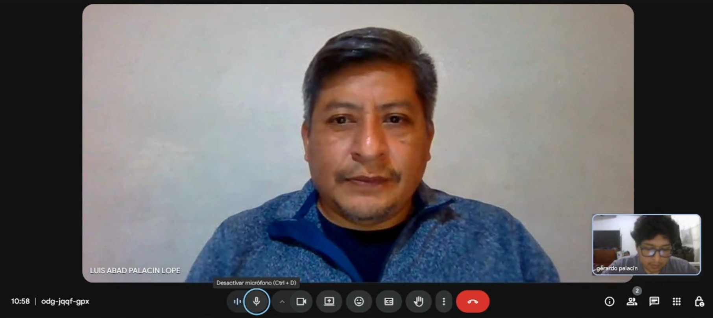
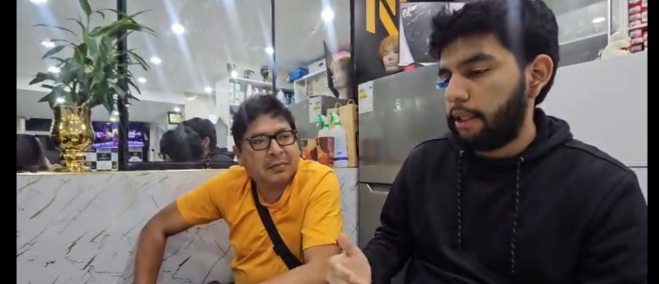
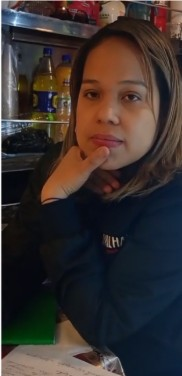

## 2.2. Entrevistas
### 2.2.1. Diseño de entrevistas
- **Segmento 1: Empresas de transporte de camiones**
    - **Preguntas de descubrimiento:**
        * ¿Cuál es su nombre completo y edad?  
        * ¿Podría contarme brevemente sobre su negocio de transporte? (ubicación, mercancía principal, tamaño de flota, número de empleados).  
        * ¿Quiénes son sus clientes principales (distribuidores, bares, licorerías, supermercados)?  
        * ¿Qué dispositivos electrónicos utilizan más para coordinar rutas y entregas? (smartphone, tablet, computadora).  
        * ¿Qué marcas, softwares o plataformas utilizan actualmente para el seguimiento de la flota?
    - **Preguntas principales**
        * ¿Cómo planifican las rutas de entrega? ¿Usan sistemas digitales o lo hacen manualmente?  
        * ¿Qué tan frecuentes son los problemas de pérdidas o daños en la carga?  
        * ¿Qué costos adicionales generan estos problemas (roturas, retrasos, reclamos de clientes)?  
        * ¿Qué información en tiempo real sería más valiosa para ustedes? (estado de la carga, ubicación exacta, temperatura, impactos, alertas).  
        * ¿Qué obstáculos han tenido al implementar herramientas digitales en el pasado?  
        * Si existiera una solución que mejore la eficiencia logística, ¿Qué características serían imprescindibles para adoptarla?
- **Segmento 2: Distribuidores de licores**
    - **Preguntas de descubrimiento:**
        * ¿Cuál es su nombre completo y edad?  
        * ¿Podría contarme brevemente sobre el negocio de distribución? (ubicación, años de operación, volumen de entregas, temporadas de mayor demanda).  
        * ¿Qué tipo de clientes atienden con más frecuencia (bares, restaurantes, supermercados, licorerías)?  
        * ¿Qué dispositivos y marcas llegan a utilizar más para coordinar pedidos y entregas?  
        * ¿Qué plataformas o aplicaciones emplean actualmente para gestionar la logística?
    - **Pregutnas principales:**
        * ¿Cómo reciben información sobre retrasos, golpes o problemas durante el transporte?  
        * ¿Qué consecuencias tienen las demoras o roturas en su relación con clientes finales?  
        * ¿Qué indicadores o reportes logísticos consideran más importantes? (tiempos, costos, estado de la carga, incidencias).  
        * ¿Qué canales prefieren para comunicarse con transportistas (llamadas, WhatsApp, apps)?  
        * ¿Cuál ha sido la peor experiencia que han tenido en entregas?  
        * Si existiera una solución que mejore la eficiencia logística, ¿Qué características serían imprescindibles para adoptarla?
- **Segmento 3: Dueños de negocios (bares, licorerias, supermercados)**
    - **Preguntas de descubrimiento:**
        * ¿Cuál es su nombre completo y edad?  
        * ¿Podría contarme brevemente sobre su establecimiento? (ubicación, tamaño, años en el mercado, tipo de clientes).  
        * ¿Qué dispositivos usan más para gestionar inventario y pedidos (PC, smartphone, tablet)?  
        * ¿Qué canales digitales utilizan para comunicarse con proveedores (llamadas, WhatsApp, correo, apps)?

    - **Preguntas principales:**
        * ¿Cómo es la experiencia actual de coordinar pedidos con sus proveedores de licores?  
        * ¿Qué problemas enfrentan más seguido con los pedidos (retrasos, falta de stock, cambios de precio, golpes en la mercadería)?  
        * ¿Qué información consideran esencial recibir al hacer un pedido? (confirmación, tiempo estimado, trazabilidad).  
        * ¿Cómo les gustaría recibir actualizaciones sobre sus pedidos? (notificaciones, seguimiento en tiempo real, contacto directo).  
        * ¿Qué tan importante es la transparencia y seguridad en la entrega de licores para su negocio?  
        * Si existiera una solución que mejore la eficiencia logística, ¿Qué características serían imprescindibles para adoptarla?

### 2.2.2. Registro de entrevistas

**Segmento 1: Empresas de transporte de camiones**

- **Información de entrevista \#1:**

    - **Nombres:** Luis Abad  
    - **Apellidos:** Palacin Lope  
    -  **Edad:** 50 años  
    -  **Distrito:** Santa Anita  
    -  **Screenshot:** 
        
    - **URL:**  
    - **Timing (Inicio \- Fin):**  
    - **Resumen descriptivo:** 
        
        Luis Abad Palacin López, gerente de operaciones de HPL Transport SAC, es un profesional con más de 20 años de experiencia en el rubro del transporte de carga por carretera. A sus 50 años, se caracteriza por una personalidad meticulosa, analítica y orientada a la eficiencia operativa, lo que se refleja en su forma de gestionar procesos y supervisar la flota. Su liderazgo combina disciplina y control logístico con un enfoque preventivo hacia la seguridad vial y el mantenimiento técnico. La empresa cuenta con una flota de camiones en donde transportan principalmente envases y productos terminados de la Cervecería Backus, operando tanto en Lima, provincia y la selva peruana. La ayuda de aliados logísticos son cruciales para seguir ampliando su alcance a nivel nacional, lo que categoriza la comunicación y la planificación, entre la central logística y los conductores del transporte, en un nivel alto e incluso crucial durante temporadas de mayor demanda como fiestas nacionales, Navidad y Año Nuevo.   
    
        Las tecnologías utilizadas por el usuario Luis son la plataforma Frotcom, como herramienta de seguimiento y control de flota, smartphones y computadoras personales con propósitos empresariales con el sistema operativo popular Windows. Herramientas imprescindibles al momento de querer visualizar en tiempo real las unidades, establecer geocercas, definir paradas autorizadas y notificar sobre desvíos no autorizados.  
    
        Adicionalmente, el sistema mencionado es capaz de obtener métricas como consumo de combustible y desgaste de neumáticos. Característica atractiva para el usuario para considerar el contexto completo de la unidad respectiva. A pesar de que la plataforma Frotcom cumple con la mayoría de sus expectativas, menciona como necesidad pendiente sensores de fatiga del conductor y alerta de somnolencia. De este modo, el usuario sentiría una mayor seguridad durante trayectos extensos. En resumen, el usuario presenta una alta confianza en herramientas digitales, pero también con una mirada crítica hacia la innovación mediante mejoras tangibles.

- **Información de la entrevista \#2:**

    - **Nombres:** Jordan Paolo  
    - **Apellidos:** Palacin Raraz  
    - **Edad:** 31 años  
    - **Distrito:** Santa Anita  
    - **Screenshot:**  

        
        
    - **URL:**  
    - **Timing (Inicio \- Fin):**  
    - **Resumen descriptivo:**

        Jordan Paolo Palacín Raraz, de 31 años, trabaja como analista de distribución primaria en Arca Continental Logística donde labora desde hace más de dos años y acumula cinco años y medio de experiencia en el rubro de distribución. Su perfil refleja una personalidad analítica, responsable y metódica, con un fuerte enfoque en la eficiencia operativa y la planificación logística. Muestra una comunicación clara, técnica y centrada en la resolución de problemas, lo que evidencia su conocimiento profundo de los procesos de transporte y abastecimiento nacional. En su puesto, coordina la distribución de productos a nivel nacional, asegurando que las entregas lleguen en el tiempo óptimo y con las cantidades solicitadas. Los principales clientes que atiende son almacenes propios de la compañía y mayoristas siendo sus  picos más altos entre los meses de verano y finales de año.  
    
        Respecto a su entorno tecnológico, utiliza un teléfono móvil Android (Samsung) y una laptop Toshiba T40, herramientas que le permiten mantener una conexión continua con transportistas y proveedores. Dentro de la empresa, emplean la plataforma Geotab, un sistema de GPS que centraliza el monitoreo de flotas a nivel nacional, permitiendo visualizar el tránsito de unidades, generar reportes y dar seguimiento a productos críticos. Sin embargo, reconoce que el sistema presenta limitaciones en zonas accidentadas del país, donde la señal se interrumpe.  
    
        La compañía trabaja con transportistas licitados y terceros, quienes gestionan sus propios costos de mantenimiento y desgaste. Su rol implica asegurar la planificación eficiente de las rutas, priorizando productos críticos y buscando siempre equilibrar los costos de transporte con la utilización máxima de la capacidad de carga (llenar el mayor número posible de pallets por unidad). Explica que el flete pactado con transportistas licitados es más competitivo, mientras que el de terceros suele ser más elevado, por lo que deben optimizar la asignación de rutas según conveniencia y eficiencia.  
    
        En cuanto a los problemas operativos, menciona que las mermas y pérdidas de producto son frecuentes, principalmente debido al tipo de apilamiento y a las condiciones accidentadas de las carreteras. Estas fallas impactan en la retornabilidad de unidades y, por ello, requieren de reportes rutinarios semanales. El usuario valora las tecnologías emergentes como cámaras a bordo para detectar la fatiga del conductor y monitorear incidentes, además de sensores de combustible que permiten identificar robos mediante el análisis de consumo en tiempo real. Considera que estas herramientas representan una evolución necesaria, aunque reconoce que su alto costo limita su adopción por parte de transportistas terceros.  
    
        Finalmente, menciona que la empresa está en proceso de migración al sistema SAP S/4HANA y próximamente al TMS (Transport Management System), con el objetivo de automatizar la planificación de rutas, cubicaje y costos. Reduciendo el tiempo de los procesos analíticos.

- **Información de la entrevista \#3:**

    - **Nombres:** Percy Adrián  
    - **Apellidos:** Rojas León  
    - **Edad:** 37 años  
    - **Distrito:** Lima 
    - **Screenshot:**  

        
        
    - **URL:**  
    - **Timing (Inicio \- Fin):**  
    - **Resumen descriptivo:**

        Percy Adrián Rojas León, de 37 años, es el director de una empresa de transporte de carga con varios años de experiencia en el rubro. Su personalidad refleja organización, responsabilidad y orientación a resultados, especialmente en el cumplimiento de tiempos de entrega y el cuidado de la mercancía transportada. Dirige una flota mediana de camiones, dedicada principalmente al transporte y distribución de productos de consumo y bebidas hacía bares, licorerías y supermercados, lo que evidencia su inserción en un segmento comercial con alta demanda de puntualidad y conservación del producto.

        El equipo de trabajo que lidera es reducido pero eficiente, con una estructura enfocada en la coordinación logística y la integridad de las entregas. En cuanto al uso de la tecnología, la herramienta principal es el smartphone, empleado tanto por los conductores como por el personal de logística para la comunicación y coordinación diaria. También utilizan computadoras para la gestión general y hojas de cálculo en la planificación semi-manual de rutas, combinando procedimientos tradicionales con recursos digitales básicos.

        El usuario emplea sistemas GPS estándar, los cuales permiten el rastreo de ubicación y monitoreo del avance de las entregas. No obstante, reconoce limitaciones en la automatización y precisión de los datos obtenidos. Identifica como información valiosa la posibilidad de acceder a alertas en tiempo real sobre ubicación, temperatura de la carga, impactos o movimientos bruscos, lo que revela un interés por mejorar la trazabilidad y control de las condiciones del transporte, especialmente en el manejo de botellas y líquidos frágiles. Dichas carencias pueden representar costos adicionales

        Finalmente, el usuario expresa que una solución ideal para su empresa debería caracterizarse por su facilidad de uso, especialmente desde aplicaciones móviles, de modo que tanto él como su equipo puedan integrarla sin necesidad de conocimientos técnicos complejos. Esto refleja una preferencia por tecnologías intuitivas, accesibles y compatibles con dispositivos móviles, consolidando un perfil de usuario pragmático y funcional, que busca eficiencia logística sin sacrificar simplicidad operativa.

**Segmento 2: Distribuidores de licores**

- **Información de la entrevista \#1:**

    - **Nombres:** Omar
    - **Apellidos:**   
    - **Edad:** 48 años  
    - **Distrito:** Arequipa 
    - **Screenshot:**  

        
        
    - **URL:**  
    - **Timing (Inicio \- Fin):**  
    - **Resumen descriptivo:**

        Omar es el gerente general de una distribuidora de licores ubicada en la ciudad de Arequipa, con 18 años de experiencia en el sector. A sus 48 años, se presenta como un profesional organizado, estratégico y con fuerte capacidad de negociación, cualidades que le permiten liderar de manera efectiva su equipo de colaboradores y su flota de camiones. Su función combina la dirección ejecutiva con la participación directa en acuerdos comerciales, decisiones de inversión y gestión de proveedores, mientras delega la coordinación logística diaria a un supervisor especializado.

        Las operaciones de la empresa se concentran principalmente en la atención a hoteles, cadenas de restaurantes, licorerías medianas y grandes, así como supermercados. Los periodos de mayor demanda ocurren durante las campañas de julio (Fiestas Patrias) y diciembre (Navidad y Año Nuevo), además de ferias gastronómicas y eventos corporativos, alcanzando en esos picos cerca de 600 entregas mensuales, lo que representa aproximadamente el 40% del volumen total de operaciones.

        En cuanto al uso de tecnología, la organización emplea computadoras y laptops para tareas administrativas y contables, mientras que los conductores utilizan teléfonos Android con GPS para la coordinación de rutas y el envío de reportes. Asimismo, herramientas como WhatsApp y hojas de cálculo son empleadas para el control de inventarios, facturación y comunicación operativa, evidenciando un entorno digital no tan desarrollado  parcialmente funcional.

        No obstante, Omar reconoce limitaciones significativas en la gestión actual, particularmente en la identificación oportuna de incidencias, la cual depende de reportes tardíos de los choferes o reclamos de clientes. Esta situación afecta la satisfacción y confianza de clientes clave, generando costos adicionales asociados a reposición de productos, horas extras, penalidades y envíos urgentes.

        Ante ello, el entrevistado considera prioritaria la implementación de soluciones tecnológicas avanzadas que permitan seguimiento en tiempo real, generación automática de reportes y alertas tempranas ante posibles retrasos o incidencias. Destaca que toda innovación debe garantizar un retorno de inversión claro y medible, demostrando una visión pragmática y orientada a resultados respecto a la adopción de nuevas plataformas digitales.

- **Información de la entrevista \#2:**

    - **Nombres:** Lulio Adolfo
    - **Apellidos:** Palacin Lope
    - **Edad:** 46 años  
    - **Distrito:** Lima 
    - **Screenshot:**  

        
        
    - **URL:**  
    - **Timing (Inicio \- Fin):**  
    - **Resumen descriptivo:**

        Lulio Adolfo Palacín López, supervisor de transporte en Distribuidora San Martín, cuenta con más de 10 años de experiencia en la gestión logística dentro del sector de distribución de licores. A sus 46 años, proyecta una personalidad organizada, resolutiva y comprometida con la eficiencia operativa, orientada principalmente a la programación de viajes, la coordinación con conductores y la supervisión del traslado de mercancías hacia clientes diversos, entre ellos bares, licorerías, restaurantes, pequeños supermercados y minimarkets de la ciudad de Lima.

        La empresa, ubicada en el distrito de Ate, cuenta con una flota de cinco camiones medianos y concentra su mayor volumen de operaciones durante los meses de julio (Fiestas Patrias), diciembre (Navidad y Año Nuevo) y en fines de semana o fechas festivas, alcanzando en promedio entre 150 y 160 entregas mensuales. Su gestión logística se apoya principalmente en herramientas básicas, como teléfonos móviles Android, WhatsApp y Google Maps, las cuales facilitan la comunicación y la planificación de rutas, aunque con limitaciones en automatización y trazabilidad.

        La comunicación con los conductores se mantiene de forma directa, y los incidentes se reportan mediante fotos o mensajes, aunque en ocasiones con retrasos, lo que complica el seguimiento en tiempo real de las operaciones. Lulio identifica como principales preocupaciones la merma de carga, los accidentes durante el transporte y los retrasos frente a los tiempos de entrega acordados, factores que repercuten en la satisfacción del cliente y pueden afectar la credibilidad y reputación del servicio, generando incluso cancelaciones o pérdidas de futuras oportunidades comerciales.

        Respecto a la adopción de nuevas tecnologías, el entrevistado manifiesta interés en implementar una plataforma digital que emita alertas y notificaciones ante posibles cuellos de botella, ayudando a prevenir demoras y mantener un control continuo del proceso logístico. Valora especialmente que la herramienta sea económica, sencilla de usar y compatible con dispositivos móviles, reflejando una visión práctica y orientada a resultados. Su principal motivación es fortalecer el control operativo, reducir pérdidas y garantizar un servicio confiable que refuerce la fidelidad y confianza del cliente.

- **Información de la entrevista \#3:**

    - **Nombres:** Luis Javier
    - **Apellidos:** Jimenéz Sandoval
    - **Edad:** 52 años  
    - **Distrito:** Lima metropolitana 
    - **Screenshot:**  

        
        
    - **URL:**  
    - **Timing (Inicio \- Fin):**  
    - **Resumen descriptivo:**

        Luis Javier Jiménez Sandoval, empresario limeño de 52 años, cuenta con 28 años de experiencia en la venta y distribución de licores, tanto al por mayor como al por menor, dentro del sector de Lima Metropolitana. Su negocio se caracteriza por una trayectoria consolidada basada en relaciones de confianza, principalmente con bares, restaurantes y licorerías, evitando atender a supermercados debido a los altos volúmenes y exigencias de bonificaciones que estos requieren. En cuanto a la estacionalidad del mercado, Javier explica que los productos de mayor demanda varían según la época del año: los licores espirituosos (whisky, vodka, ron de 40°) registran su mayor venta en otoño e invierno, mientras que las cervezas y bebidas listas para consumir (RTD) dominan las temporadas de primavera y verano. El volumen de distribución fluctúa entre 500 y 1000 cajas mensuales, dependiendo de la estacionalidad. 

        Su canal principal de comunicación con los clientes es WhatsApp, descartando el uso del correo electrónico por considerarlo más lento. Afirma que su red de clientes se ha formado a través del boca a boca y las recomendaciones personales, aunque reconoce la necesidad de adaptarse al entorno digital actual, por lo que planea implementar redes sociales como canal de comercialización en el corto plazo. Javier muestra una actitud receptiva hacia la digitalización, manifestando interés en una aplicación móvil que le permita agilizar pedidos, filtrar clientes y garantizar la seguridad en las transacciones. Destaca la importancia de que el sistema implementa filtros de validación como verificación de identidad o registro RUC para evitar fraudes, comparándolo con los sistemas de clasificación usados en servicios como eDriver o aplicaciones telefónicas que identifican llamadas sospechosas.

        En cuanto a su gestión operativa, identifica como una necesidad fundamental conocer el estado de sus pedidos en tiempo real, debido a los retrasos frecuentes en las entregas, especialmente en Lima, donde el tráfico complica la puntualidad de los repartos. Señala que los retrasos generan pérdidas de tiempo y posibles cancelaciones de parte de clientes que recurren a otros distribuidores, afectando su reputación y rentabilidad. Considera que los indicadores logísticos dentro de una aplicación debería permitirles gestionar inventarios, controlar la rotación de productos y exhibir el catálogo disponible para la venta, todo dentro de un entorno seguro y accesible para los clientes verificados.

        El usuario también comentó sus experiencias negativas del rubro como intentos de estafa de clientes y pagos falsos. Por ello, insiste en que cualquier sistema digital debe incluir mecanismos de seguridad y validación de compradores, además de seguimiento georreferenciado de unidades de reparto que permitan visualizar las rutas y el estado de las entregas en tiempo real. Finalmente, recomienda que los desarrolladores de este tipo de plataformas consideren las “variables ocultas” del mercado de licores, como las bonificaciones por volumen, premios de fidelización (viajes, electrodomésticos, autos) y los costos logísticos derivados del tráfico y los retrasos urbanos, para ofrecer un sistema integral que refleje el valor real de la operación.

**Segmento 3: Dueños de negocios (bares, licorerias, restaurantes)**

- **Información de la entrevista \#1:**

    - **Nombres:** Carla
    - **Apellidos:** Martinéz
    - **Edad:** 33 años  
    - **Distrito:** San Juan de Miraflores 
    - **Screenshot:**  

        
        
    - **URL:**  
    - **Timing (Inicio \- Fin):**  
    - **Resumen descriptivo:**

        Carla Martínez, administradora de un negocio minorista con tres años de operación, demuestra una personalidad organizada, metódica y enfocada en el control del inventario. A sus 33 años, combina disciplina y adaptabilidad en la gestión, destacando por un liderazgo práctico y una visión orientada a la eficiencia operativa. Su labor diaria se centra en coordinar los procesos de abastecimiento y mantener la estabilidad del flujo de productos, apoyándose principalmente en herramientas digitales básicas.

        El negocio utiliza una computadora de escritorio (PC) para la gestión de pedidos e inventarios, mientras que la comunicación con los proveedores se realiza mediante llamadas telefónicas, correos electrónicos y WhatsApp, lo que le permite mantener un contacto directo y constante con sus aliados comerciales. Este enfoque refleja un entorno de gestión digital sencillo pero funcional, basado en la confianza y la comunicación continua.

        En cuanto a sus criterios de selección de proveedores, Carla prioriza la confianza, calidad de los productos y trayectoria de la marca en el mercado. Suele realizar pedidos con anticipación para garantizar la disponibilidad de stock, aunque reconoce que la coordinación puede resultar variable, dependiendo de la demanda y del control de los artículos más solicitados. Entre las principales dificultades que enfrenta se encuentran los retrasos en las entregas, la falta de productos específicos y las fluctuaciones inesperadas en los precios, factores que afectan la planificación y satisfacción del cliente.

        Carla considera esencial contar con confirmaciones claras de envío y conocer los horarios exactos de llegada de los pedidos, lo que aportaría previsibilidad y control sobre las operaciones. Además, percibe que un sistema de seguimiento en tiempo real incrementa la confianza y transparencia en la relación con los proveedores. Finalmente, expresa una disposición abierta a invertir en soluciones tecnológicas que aporten transparencia, confiabilidad y puntualidad, siempre que estas estén alineadas con su misión de ofrecer un servicio de calidad y confianza a la sociedad.

- **Información de la entrevista \#2:**

    - **Nombres:** Alejandro
    - **Apellidos:** Rodrigez
    - **Edad:** 37 años  
    - **Distrito:** Lima metropolitana 
    - **Screenshot:**  

        
        
    - **URL:**  
    - **Timing (Inicio \- Fin):**  
    - **Resumen descriptivo:**

        Alejandro Rodríguez, de 37 años, es propietario de un bar de tamaño mediano ubicado en Lima, con varios años de funcionamiento. Su negocio se orienta a un público joven y adulto joven. Alejandro proyecta una personalidad organizada, analítica y con interés en mantener control operativo, aunque delega parte de la gestión a su equipo. Muestra predisposición al uso de la tecnología, aunque prefiere mantener una supervisión directa de los procesos administrativos.

        En cuanto al uso de tecnología, su dinámica de trabajo se apoya principalmente en smartphones y laptops. Los smartphones se emplean para la coordinación rápida de inventarios y pedidos, mientras que la laptop es su herramienta preferida para redactar reportes, realizar facturación y revisar detalles administrativos. No menciona el uso de software especializado, sino herramientas comunes y accesibles, lo que indica un nivel medio de digitalización.

        Alejandro utiliza WhatsApp como medio principal para interactuar con proveedores, destacando su rapidez y practicidad. Para proveedores más grandes o con mayor formalidad, recurre al correo electrónico o a los perfiles corporativos de las empresas, lo que refleja adaptabilidad según el tipo de interlocutor. Son herramientas con procesos lentos o no estandarizados para adoptarlo como regla dentro de un negocio formal.

        Por consiguiente, el usuario nos indicó como dificultades frecuentes los retrasos en pedidos, cambios de última hora de la llegada de su mercancía, modificaciones de precios sin previo aviso y problemas de productos dañados o mal empacados.

        Alejandro enfatiza la necesidad de confirmaciones inmediatas de pedidos, visibilidad del estado de las entregas en tiempo real y la posibilidad de reportar incidentes o inconvenientes directamente en una plataforma. Muestra especial interés en contar con un sistema integrado y automatizado, con notificaciones automáticas, checklists previos a despachos y seguimiento centralizado de todo el proceso logístico. Considera que esto permitiría reducir errores y mejorar la comunicación con proveedores y repartidores.

        En general, es un usuario pragmático, tecnológicamente activo pero no especializado. Sus hábitos digitales se apoyan en herramientas cotidianas (WhatsApp, correo, laptop), y su visión de mejora está centrada en la automatización y la trazabilidad a favor de su negocio.

- **Información de entrevista \#3:**

    * **Nombres:**  
    * **Apellidos:**   
    * **Edad:**   
    * **Distrito:**   
    * **Screenshot:**  
    * **URL:**  
    * **Timing (Inicio \- Fin):**  
    * **Resumen descriptivo:**

### 2.2.3. Análisi de entrevistas

**Segmento 1: Empresas de transporte de camiones**

    Se analizaron entrevistas a gerentes de operaciones de empresas transportistas que utilizan herramientas digitales básicas para coordinar sus flotas. La información permitió identificar características objetivas y subjetivas clave para la planificación del proyecto.

    | Característica | Mención | % | Evidencia |
| :---- | :---- | :---- | :---- |
| **Uso de smartphones Android como herramienta principal de coordinación** | **3/3** | **100%** | **Los tres entrevistados mencionan el uso de teléfonos móviles Android para comunicación, coordinación y seguimiento de rutas.** |
| **Uso de hojas de cálculo (Excel) para planificación o control** | **2/3** | **66%** | **Percy y Luis refieren el uso de hojas de cálculo para planificar rutas y monitorear operaciones administrativas.** |
| **Empleo de sistemas GPS para rastreo de flotas** | **3/3** | **100%** | **Todos utilizan GPS: Luis (Frotcom), Jordan (Geotab) y Percy (GPS básico).** |
| **limitaciones tecnológicas por costo o falta de capacitación** | **2/3** | **66%** | **Luis y Percy mencionan que los costos y la capacitación son obstáculos para implementar nuevas herramientas digitales.** |
| **Interés en monitoreo avanzado (alertas de temperatura, impactos, fatiga del conductor)** | **3/3** | **100%** | **Todos expresan interés en contar con datos más detallados y sensores que garanticen seguridad y trazabilidad.** |
| **Predisposición positiva hacia la digitalización con enfoque práctico** | **3/3** | **100%** | **Todos valoran la tecnología, pero priorizan la utilidad y el retorno operativo sobre la complejidad del sistema.** |
| **Interés en integrar sistemas más robustos (TMS, SAP, Frotcom)** | **2/3** | **66%** | **Luis utiliza Frotcom y Jordan está en proceso de migración hacia SAP S/4HANA y TMS para automatizar procesos.** |
| **Uso de computadoras con sistema Windows** | **3/3** | **100%** | **Se menciona explícitamente el uso de laptops o PCs con Windows para gestiones logísticas y administrativas.** |
| **Problemas frecuentes: mermas o daños en la carga** | **3/3** | **100%** | **Mencionan pérdidas o daños por malas condiciones de camino, manejo o apilamiento deficiente.** |
| **Alta experiencia en el rubro de transporte y distribución** | **3/3** | **100%** | **Todos superan los 5 años de experiencia en transporte, logística o distribución a nivel nacional.** |

**Insights**

1. Aunque las empresas utilizan GPS o plataformas digitales, el smartphone Android sigue siendo la herramienta central para la coordinación diaria. Esto evidencia una digitalización práctica pero aún limitada, centrada en la comunicación más que en la automatización.  
2. Los tres gerentes valoran las soluciones tecnológicas que aporten eficiencia tangible sin requerir procesos complejos. Esto sugiere que el mercado está preparado para herramientas intuitivas y modulares antes que por sistemas de gran escala.  
3. La recurrencia de pérdidas por apilamiento deficiente o carreteras en mal estado refleja la falta de integración entre monitoreo digital y gestión física de las operaciones, abriendo espacio para sistemas predictivos o de alerta temprana.

**Segmento 2: Distribuidores de licores**

Se analizaron entrevistas a dos distribuidores con amplia experiencia logística. Ambos presentan prácticas similares pese a diferencias en el tamaño de sus flotas.

| Característica | Mención | % | Evidencia |
| :---- | :---- | :---- | :---- |
| **Uso de smartphones Android y WhatsApp para coordinar entregas y pedidos** | **3/3** | **100%** | **Todos los entrevistados mencionan el uso de teléfonos móviles y WhatsApp como herramientas clave de comunicación entre conductores, clientes y supervisores.** |
| **Uso de computadoras o laptops para tareas administrativas** | **3/3** | **100%** | **Los tres entrevistados reportan emplear computadoras para la gestión de inventarios, facturación o contabilidad.** |
| **Dependencia de reportes manuales o tardíos sobre incidencias** | **2/3** | **66%** | **Omar y Lulio afirman que los incidentes se reportan mediante mensajes o fotos, a menudo con demoras.** |
| **Valoración del retorno de inversión (ROI) como criterio de adopción tecnológica** | **2/3** | **100%** | **Omar y Luis Javier enfatizan que las nuevas tecnologías deben justificar su costo mediante beneficios medibles.** |
| **Interés en seguridad digital y validación de clientes o pedidos** | **1/3** | **33%** | **Luis Javier menciona la necesidad de filtros de validación y mecanismos antifraude en plataformas digitales.** |
| **Reconocimiento de pérdidas y mermas por fallas logísticas o incidentes** | **2/3** | **66%** | **Omar y Lulio reportan pérdidas de producto y accidentes como problemas frecuentes.** |
| **Falta de trazabilidad o monitoreo en tiempo real** | **3/3** | **100%** | **Los tres coinciden en la necesidad de soluciones que brinden seguimiento continuo y alertas ante retrasos o incidencias.** |
| **Experiencia consolidada en el rubro de distribución** | **3/3** | **100%** | **Todos superan los 10 años en el sector, con cargos de liderazgo o supervisión logística.** |

**Insights**

1. La tecnología se usa más para comunicación y gestión básica que para control logístico integral; aún predomina la dependencia de hojas de cálculo y reportes manuales.  
2. Algunos actores, especialmente los más digitalizados, demandan sistemas con validación antifraude y monitoreo de pedidos para evitar estafas o entregas fallidas.  
3. A pesar de décadas de experiencia, los líderes del segmento aún no cuentan con herramientas de gestión automatizada que integren la información logística y comercial.

**Segmento 3: Dueños de negocios**

Este segmento corresponde a pequeños comerciantes minoristas con entre 2 y 3 años de experiencia consolidando su negocio propio.

| Característica | Mención | % | Evidencia |
| :---- | :---- | :---- | :---- |
| **Perfil organizado y orientado al control operativo**  | **2/2** | **100%** | **Ambos priorizan la planificación, el seguimiento de inventarios y el control de los procesos.** |
|  **Uso de tecnología básica o media (sin sistemas especializados)** | **2/2** | **100%** | **Utilizan PC, laptops y smartphones para operaciones diarias. No usan software avanzado.** |
| **Valoran la confianza y puntualidad de proveedores** | **2/2** | **100%** | **La fiabilidad, cumplimiento y comunicación clara son los factores más importantes.** |
| **Motivación por mantener la calidad del servicio** | **2/2** | **100%** | **Consideran que la eficiencia tecnológica mejora la satisfacción del cliente final.** |
| **Interés en automatizar la gestión de pedidos** | **2/2** | **100%** | **Buscan optimizar tiempos y tener visibilidad en tiempo real de los pedidos.** |

**Insights**

1. Los dueños de negocios manejan herramientas tecnológicas básicas (WhatsApp, correo, PC) sin recurrir a software especializado, lo que deja espacio para soluciones accesibles y fáciles de usar.  
2.  La motivación principal para adoptar nuevas tecnologías es mantener la satisfacción del consumidor y no perder reputación por errores o demoras logísticas.

3. Los retrasos, cambios de última hora y precios variables generan desconfianza y afectan la planificación del negocio.

## 2.3. Needfinding
### 2.3.1. User Personas

    En esta sección se presentan tres **User Personas** que representan los segmentos clave del proyecto: los **Transportistas de carga**, las **Distribuidoras de licores** y los **Dueños de bares y licorerías**. Estos perfiles permiten comprender en profundidad las **necesidades, motivaciones, frustraciones y comportamientos** de los usuarios potenciales del sistema **GlassGo**, una plataforma que busca mejorar la trazabilidad, la eficiencia y la seguridad en el transporte de licores en envases de vidrio en el Perú.

    El **User Persona Jorge Mendoza** representa a los transportistas independientes de carga pesada, encargados de trasladar bebidas entre distintas ciudades del país. Jorge tiene más de veinte años de experiencia en el rubro y trabaja con una flota envejecida que le genera dificultades operativas y pérdidas por rotura de botellas. Ha probado algunas herramientas de geolocalización, pero ninguna se adapta realmente a las condiciones de las rutas locales ni a su nivel de familiaridad digital. Su principal motivación es **optimizar las rutas y reducir los costos de combustible y mantenimiento**, logrando entregas puntuales que le permitan mantener su reputación y contratos. Busca una solución simple, accesible y confiable que le permita monitorear su carga sin depender de procesos manuales o llamadas telefónicas.

    El **User Persona Andrea Flores** representa a las distribuidoras de licores, responsables de garantizar que los pedidos lleguen completos y en buen estado. Andrea gestiona la logística de distribución para bares y restaurantes en Lima, y con frecuencia enfrenta pérdidas por robos parciales o botellas dañadas durante el transporte. Aunque ha implementado algunos sistemas de control, estos suelen ser costosos o poco adaptables a las necesidades de su empresa. Su motivación principal es **contar con trazabilidad total de la carga y minimizar los riesgos en cada entrega**, asegurando la confianza de sus clientes. Busca una plataforma que le ofrezca visibilidad en tiempo real, alertas automáticas y reportes simples que le permitan tomar decisiones rápidas sin depender de múltiples canales de comunicación.

    Por su parte, el **User Persona José Álvarez** representa a los dueños de bares y licorerías, quienes dependen de la puntualidad de sus proveedores para mantener el flujo de ventas. José administra un bar en Miraflores y ha tenido que lidiar con entregas tardías o incompletas que afectan directamente su inventario y promociones. Ha intentado llevar un control de pedidos mediante hojas de cálculo y mensajería, pero estos métodos le resultan ineficientes y poco precisos. Su motivación principal es **contar con un sistema que le brinde transparencia y puntualidad en los pedidos**, permitiéndole planificar mejor sus compras y evitar pérdidas por falta de stock. Busca una herramienta intuitiva, visual y de fácil acceso que le permita recibir notificaciones de entrega en tiempo real y mantener comunicación directa con sus proveedores.

    En conjunto, estos tres perfiles reflejan los principales desafíos y oportunidades dentro de la cadena logística del transporte de licores en el Perú. Comprender sus necesidades y comportamientos permite al equipo de diseño **alinear las funcionalidades de GlassGo con las expectativas reales de los usuarios finales**, asegurando una solución eficiente, escalable y centrada en la experiencia de todos los actores involucrados.
