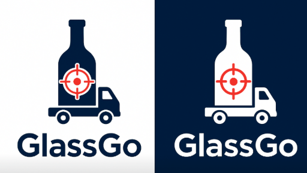
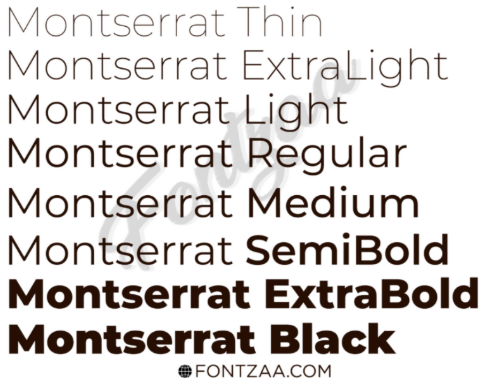
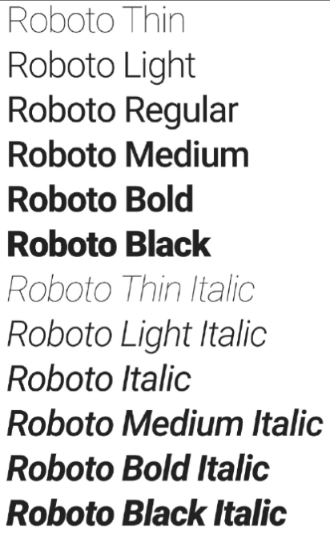
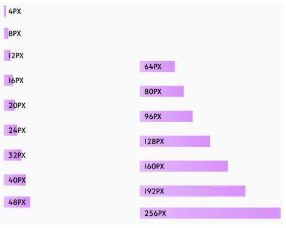

# 4. Capitulo IV: Product Design

## 4.1. Style Guidelines

Un style Guidelines es un conjunto de reglas y normas que definen cómo se debe redactar, diseñar y presentar documentos, contenido web y software. A continuación, se detallan las especificaciones de los parámetros implementados en la estructura del proyecto.

### 4.1.1. General Style Guidelines

- **Branding history**

    Para la creación del logo de nuestro producto GlassGo, se ha optado por un diseño moderno y minimalista que refleje las intenciones de la aplicación. El logotipo se compone de una tipografía elegante y sencilla, acompañada de un icono que simboliza eficiencia rápida y la perdurabilidad del producto durante el envío al igual que una frase honesta y alentadora. Mostrando colores que demuestran seguridad, rapidez y equilibrio como lo son el blanco, gris, verde, naranja y azul.

    

- **Typography**

    Para la creación del logo de nuestro producto GlassGo, se ha optado por un diseño moderno y minimalista que refleje las intenciones de la aplicación. El logotipo se compone de una tipografía elegante y sencilla, acompañada de un icono que simboliza eficiencia rápida y la perdurabilidad del producto durante el envío al igual que una frase honesta y alentadora. Mostrando colores que demuestran seguridad, rapidez y equilibrio como lo son el blanco, gris, verde, naranja y azul.

    
    

- **Colors**

    La paleta de colores de GlassGo se compone de tonos que transmiten confianza, rapidez y profesionalismo, valores esenciales para una marca enfocada en la entrega segura de productos. El azul principal refleja estabilidad y seguridad, mientras que el naranja aporta dinamismo y movimiento, reforzando la idea de inmediatez. El gris neutro equilibra y aporta sobriedad, asegurando una comunicación clara y profesional.

    - *Azul ->#002140*

    - *Naranja ->#FF8A00*

    - *Gris Medio ->#6B6B6B*

    - *Blanco ->#FFFFFF*
    
    - *Negro ->#000000*

    

- **Spacing**

    La paleta de colores de GlassGo se compone de tonos que transmiten confianza, rapidez y profesionalismo, valores esenciales para una marca enfocada en la entrega segura de productos. El azul principal refleja estabilidad y seguridad, mientras que el naranja aporta dinamismo y movimiento, reforzando la idea de inmediatez. El gris neutro equilibra y aporta sobriedad, asegurando una comunicación clara y profesional.

    
    

### 4.1.2. Web Style Guidelines

Para GlassGo, estamos planeando desarrollar una plataforma web.Por lo tanto, implementaremos un diseño adaptable(conocido como Web Responsive Design) con el objetivo de optimizar la presentación de información en cualquier dispositivo.Esto asegurará que el contenido se mantenga intacto y, en última instancia, mejorará la experiencia del usuario.

Como equipo, hemos optado por incorporar el patrón de diseño en forma de F en nuestro sitio web. Este patrón es especialmente adecuado para GlassGo, ya que los usuarios suelen explorar el contenido de manera rápida y priorizando la información de la parte superior e izquierda de la pantalla. Con ello, se logra resaltar datos relevantes desde el inicio y facilitar la lectura de los apartados clave.

## 4.2. Information Arquitecture

### 4.2.1. Organization Systems

- **Menu Principal**

    | Tópico     | Definición                                                                                             |
    |------------|--------------------------------------------------------------------------------------------------------|
    | Home Page  | La página de inicio puede mostrar una vista general del servicio y destacar las características clave. |
    | Log in     | La página para que el usuario ingrese a su sesión. En caso de no tener sesión hay una sección para poder registrarse gratis en el servicio web. |
    | Technical Support | La página ofrece un espacio para que los usuarios compartan sus dudas, asistencia técnica o quejas que se encuentren con el sistema. |

- **Página de suscripción**

    | Tópico     | Definición                                                                                             |
    |------------|--------------------------------------------------------------------------------------------------------|
    | Plan Empresa de Transportistas | Plan para las empresas que busquen una alianza con un distribuidor. Los beneficios son: tarifas preferenciales, reportes avanzados y soporte prioritario. |
    | Plan Proveedor de Licores | Plan para los distribuidores que buscan una solución logística para manejar correctamente sus recursos. |
    | Plan Dueño de Negocios | Plan individual para los negocios comunes como restaurantes, bares y licorerías. |

- **Página de Log in**

    | Tópico                    | Definición |
    |---------------------------|------------|
    | Registro y Auntenticación | Plan para las empresas que busquen una alianza con un distribuidor. Los beneficios son: tarifas preferenciales, reportes avanzados y soporte prioritario. | 

- **Otras páginas y funciones**

    | Tópico | Definición |
    |--------|------------|
    | Perfil de usuarios | La página de inicio puede mostrar una vista general del servicio y destacar las características clave. |
    | Configuraciones | La página para que el usuario ingrese a su sesión. En caso de no tener sesión hay una sección para poder registrarse gratis en el servicio web. |
    | Acerca de nosotros | La página ofrece un espacio para que los usuarios compartan sus dudas, asistencia técnica o quejas que se encuentren con el sistema. |
    | Barra de navegación | Una barra de navegación clara y consistente en la parte superior de cada página facilita la navegación entre las secciones principales de la aplicación. |
    | Responsive Design | La aplicación debe ser fácil de usar tanto en dispositivos de escritorio como en dispositivos móviles,adaptando la interfaz de usuario según el tamaño de la pantalla. |

### 4.2.2. Labeling System

Para los sistemas de etiquetado, hemos optado por organizar el contenido mediante encabezados que agrupen las seccione las que el usuario puede acceder. De esta manera, el usuario sabe dónde hacer clic para acceder a las secciones correspondientes.

| Tópico           | Definición                                                                 |
|------------------|----------------------------------------------------------------------------|
| Home Page        | Sección principal a la cual llegará el usuario al entrar al link de la aplicación web. |
| Subscription     | En esta sección, se podrán ver los planes y tarifas disponibles con los cuales contamos. |
| Technical Support| Esta es la sección en la cual se le brindará al usuario todos los canales por los cuales nos puede contactar. |

### 4.2.3. SEO Tags and Meta Tags

- **Landing Page**

    - **Charset:**

        *< meta charset="utf-8" >*

        Indica al navegador cómo interpretar los caracteres de texto. Al especificar UTF-8, se garantiza que la landing de GlassGo muestre correctamente tildes, la letra "ñ" y símbolos especiales, asegurando una visualización adecuada en cualquier idioma.

    - **Viewport(responsive):**

        *< meta name="viewport" content="width=device-width, initial-scale=1" >*

        Permite que la página se adapte a diferentes dispositivos (móvil, tablet, PC), asegurando que la presentación de GlassGo sea legible y óptima en cualquier pantalla.
    
    - **Title (SEO):**

        *< title >GlassGo | Transporte seguro y trazabilidad de envíos en vidrio < /title >*

        Define el título que aparecerá en la pestaña del navegador y en los resultados de búsqueda. Su función es dar una descripción clara y concisa del servicio principal de GlassGo.

    - **Meta Description (SEO):**

        *< meta name="description" content="GlassGo ofrece transporte seguro y trazabilidad de envíos en vidrio. Reduce pérdidas, asegura la integridad del producto y mejora la eficiencia logística." >*

        Proporciona un resumen breve que aparecerá en los resultados de búsqueda. Su objetivo es atraer a los usuarios interesados en soluciones de logística sostenible y transporte seguro.

    - **Meta Keywords (SEO, en desuso para Google):**

        *< meta name="keywords" content="transporte de vidrio, logística sostenible, trazabilidad, distribución segura, envíos rápidos, GlassGo" >*

        Identifica palabras clave relacionadas con el servicio de GlassGo. Aunque actualmente su impacto es limitado, sigue siendo útil para sistemas de indexación básicos.

    - **Meta Author:**

        *< meta name="author" content="Equipo GlassGo" >*

        Atribuye la autoría del contenido del landing al equipo responsable del proyecto GlassGo.

    - **Meta Robots:**
    
        *< meta name="robots" content="index, follow" >*

        Permite a los motores de búsqueda indexar la página de GlassGo y seguir sus enlaces, asegurando mayor visibilidad.

    - **Meta Language:**

        *< meta name="language" content="es" >*

        Informa que el contenido de la landing está en español, optimizando su indexación y compatibilidad con navegadores.

    - **Meta Copyright:**

        *< meta name="copyright" content="GlassGo 2025" >*

        Indica la titularidad de los derechos de autor del contenido y diseño de la landing.

- **Web Application:**

    - **Charset:**

        *< meta charset="utf-8" >*

        Asegurar que todos los caracteres y símbolos en la interfaz de la aplicación GlassGo se visualicen correctamente.

    - **Viewport(responsive):**

        *< meta name="viewport" content="width=device-width, initial-scale=1" >*

        Garantiza que la aplicación web (panel de gestión, dashboard de trazabilidad) sea totalmente responsiva y se adapte a diferentes dispositivos.
    
    - **Title (SEO):**

        *< title >GlassGo | Transporte seguro y trazabilidad de envíos en vidrio < /title >*

        Define el título que aparece en el navegador para identificar el panel de la aplicación web.

    - **Meta Description (SEO):**

        *< meta name="description" content="Panel interno de GlassGo para gestionar envíos, trazabilidad y planes de suscripción. Acceso exclusivo para usuarios registrados." >*

        Describe el contenido del panel, aunque su relevancia en SEO es limitada por ser un espacio interno.

    - **Meta Author:**

        *< meta name="author" content="Equipo GlassGo" >*

        Atribuye el desarrollo del panel de control a la marca.

    - **Meta Robots:**
    
        *< meta name="robots" content="noindex, nofollow" >*

        Evita que los motores de búsqueda indexen contenido privado de la aplicación (historial de envíos, métricas, etc.).

    - **Meta Language:**

        *< meta name="language" content="es" >*

        Declara que el idioma principal del panel de GlassGo es español.

    - **Meta Copyright:**

        *< meta name="copyright" content="GlassGo 2025" >*

        Protege legalmente el contenido y diseño del software de GlassGo.

### 4.2.4. Searching Systems

El motor de búsqueda es fundamental para que los usuarios encuentren rápidamente detalles específicos.

- **Características clave:**

    Las búsquedas por objetivos le permitirá al usuario como dueño de negocio, transportistas o distribuidores son:

    - Identificar impactos en el cargamento en las últimas 24h.

    - Prever rutas con altos índices de incidencias durante el trayecto, guardar esa información para que más transportistas manejen con cautela.

    - Generar evidencia si se concreta algún reclamo por parte del cliente o el proveedor.

    - Verificar el estado de la carga antes de aceptar.

    - Etiquetar inventario de alta importancia durante temporadas altas.

    - Consultar el historial de transporte para prevenir posibles roturas del cargamento.

### 4.2.5. Navigation Systems

El Sistema de Navegación es la estructura que permite a los usuarios desplazarse eficientemente entre las distintas secciones y páginas de la aplicación.

- **Estructura de navegación:**

    - Logo - link to Homepage

    - Homepage— resumen / landing con beneficios y CTA

    - Solutions / Servicios — páginas por segmento

        - Transportistas

        - Proveedores de licores

        - Comercios (Dueños de negocios)

    - Subscriptions / Planes — comparación de planes y precios

    - Support / Soporte — Centro de ayuda, FAQ, contacto

    - Contact — formulario de contacto / ventas

    - Buscar (Search) — campo de búsqueda global

    - Botón Log In / Sign Up (derecha)

    
